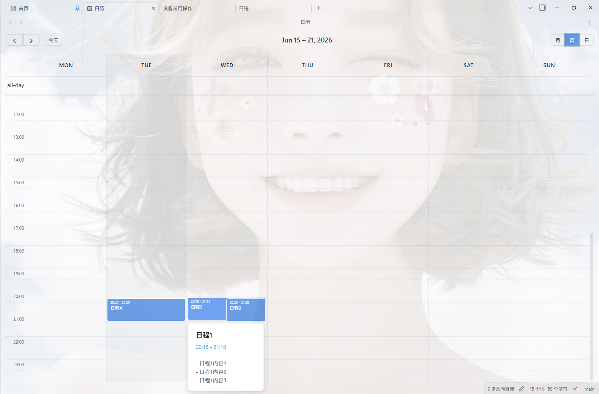
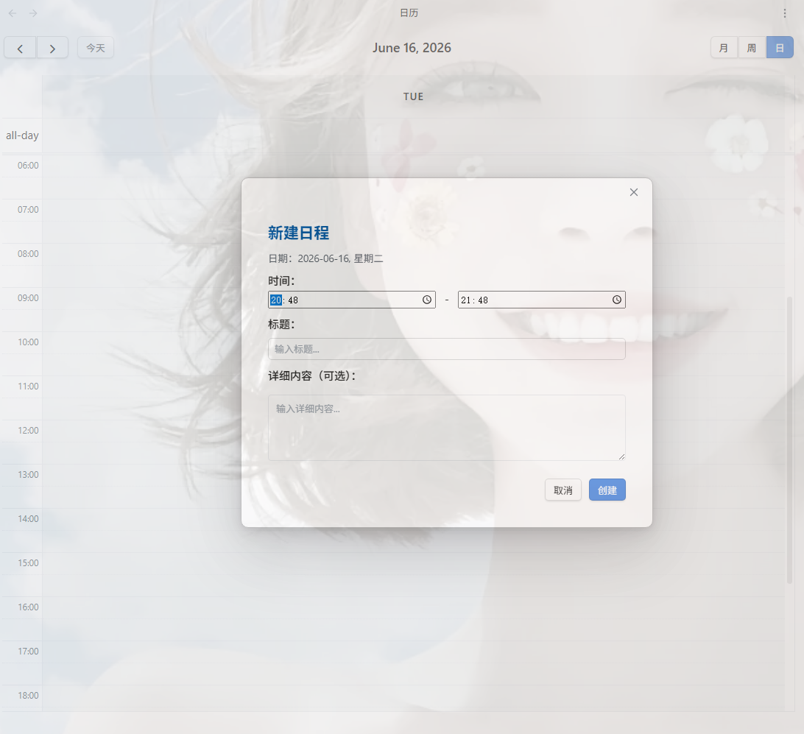

# Obsidian 单文件日历 (Single File Calendar)

一个功能强大的 [Obsidian](https://obsidian.md) 插件，提供月视图、周视图和日视图，将所有日程记录在同一个 Markdown 文件中。

## ✨ 主要特性

### 📅 多视图支持

**月视图**：概览整月日程，快速定位和创建日程。

**周视图**：详细查看一周的日程安排。

**编辑界面**：支持时间配置；日程支持右击删除修改。

### 📝 单文件存储

所有日程都记录在同一个 Markdown 文件中，使用标准 Markdown 格式：

### 🎯 核心功能

1. **日历视图**
   - 支持月/周/日三种视图模式
   - 点击日期快速创建日程
   - 点击日程条目跳转到对应内容
   - 右键菜单支持日程编辑和删除

2. **日程管理**
   - 支持设置开始时间和结束时间
   - 自动保存，无需手动操作
   - 支持拖拽调整日程时间（即将推出）

3. **高度可配置**
   - 自定义日程文件名称
   - 自定义日程文件存放路径
   - 自定义日期格式
   - 自定义月份标题格式
   - 自定义日程区块标题级别

## 📦 安装

1. 下载最新版本的 `main.js`、`styles.css` 和 `manifest.json`
2. 在你的 Obsidian 库中创建文件夹：`你的库/.obsidian/plugins/single-file-calendar/`
3. 将下载的文件复制到该文件夹
4. 重启 Obsidian
5. 在设置 > 第三方插件中启用"Single File Calendar"

## 🚀 使用方法

### 基本操作

1. **打开日历**
   - 点击左侧功能区（Ribbon）的日历图标
   - 使用命令面板（Ctrl/Cmd + P）搜索"显示日历"

2. **创建日程**
   - 在月视图中点击日期创建日程
   - 在周/日视图中点击时间区域创建日程

3. **编辑日程**
   - 点击日程条目跳转到 Markdown 文本
   - 右键点击日程可进行编辑或删除

4. **切换视图**
   - 使用日历顶部的按钮切换月/周/日视图

### 设置选项

在 Obsidian 设置 > 第三方插件 > Single File Calendar 中可以配置：

- **日程文件名**：默认为"日程"
- **日程文件位置**：留空则存储在库的根目录
- **日程区块标题级别**：支持 h2 到 h6
- **日程区块日期格式**：使用 moment.js 格式
- **月份标题格式**：使用 moment.js 格式

## 💡 设计理念

原始的 Obsidian 日程系统为每一天创建一个单独的文件，这会导致大量的文件累积。虽然有很多插件可以管理这些文件，但它们并没有改变底层文件结构。

本插件将所有日程集中在同一个 Markdown 文件中，具有以下优势：

- 📁 **减少文件数量**：避免大量小文件累积
- 🔍 **便于搜索**：在单个文件中快速定位日程
- 🔄 **易于同步**：单个文件更容易在不同设备间同步
- 📊 **更好的概览**：多视图支持提供更好的日程概览

## 🛠️ 技术栈

- [React](https://react.dev/) - UI 框架
- [FullCalendar](https://fullcalendar.io/) - 日历组件
- [Obsidian API](https://docs.obsidian.md/Reference/TypeScript+API) - Obsidian 插件 API

## 📋 系统要求

- Obsidian 1.7.2 或更高版本
- 支持桌面和移动端

## 📜 许可证

MIT License

## 🤝 贡献

欢迎提交 Issue 和 Pull Request！

## 📮 反馈

如果你有任何问题或建议，请在 GitHub 上提交 Issue。

---

**注意**：如果你之前使用了 Obsidian 内置的日程插件，建议在使用本插件前禁用它，以避免混淆。
